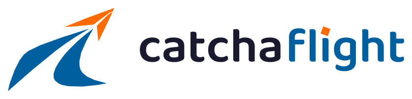

# catchaflight — Brand Asset System (Handoff)

Production-ready logo & brand identity package for **catchaflight**. Twelve clean,
retina-sharp SVG assets plus a visual brand guide. Drop this folder into any
project (web app, marketing site, native app, Claude Code repo, etc.).

> **About these files:** the SVGs are *final production assets* — deploy them
> directly. `catchaflight-brand-guide.html` is a reference/spec page (a design
> document), not application code; recreate any of its UI in your own stack as
> needed, but the `assets/*.svg` files themselves are ready to ship as-is.

---

## What's in the box

```
design_handoff_catchaflight_brand/
├── README.md                     ← you are here
├── catchaflight-brand-guide.html ← visual brand guide (open in a browser)
├── reference-source.jpeg         ← original brand sheet this was built from
└── assets/                       ← 12 production SVGs
    ├── catchaflight-logo-primary.svg
    ├── catchaflight-logo-dark.svg
    ├── catchaflight-logo-light.svg
    ├── catchaflight-icon.svg
    ├── catchaflight-icon-monochrome.svg
    ├── catchaflight-logo-monochrome.svg
    ├── catchaflight-favicon.svg
    ├── catchaflight-app-icon.svg
    ├── catchaflight-social-avatar.svg
    ├── catchaflight-wordmark.svg
    ├── catchaflight-wordmark-dark.svg
    └── catchaflight-brandmark.svg
```

Every SVG: transparent background · proper `viewBox` · optimised paths · no
unnecessary groups · `role="img"` + `<title>` for screen readers · scales
sharply on retina.

---

## Brand colors

| Token | Name | Hex | Use |
|---|---|---|---|
| `--cf-blue`     | Flight Blue   | `#005F9E` | Icon, "flight", UI primary |
| `--cf-orange`   | Signal Orange | `#FF6B00` | The dart **and** the dot of the *i* — accent only, never a fill or body text |
| `--cf-navy`     | Midnight Navy | `#1A1A2E` | "catcha", monochrome logo, dark backgrounds |
| `--cf-sky`      | Sky Blue      | `#3E8FD6` | "flight" + icon when placed on dark backgrounds |

```css
:root{
  --cf-blue:#005F9E;
  --cf-orange:#FF6B00;
  --cf-navy:#1A1A2E;
  --cf-sky:#3E8FD6;
}
```

## Typography

The wordmark is **custom-outlined** (Baloo 2, weight 600) and ships as vector
paths inside the SVGs — **no font file or web-font load is required** to render
the logo. If you need matching headline type elsewhere in the product, use
[Baloo 2](https://fonts.google.com/specimen/Baloo+2) (600/700).

---

## Asset reference

| File | Intended use | viewBox | Min display size | Notes |
|---|---|---|---|---|
| `catchaflight-logo-primary.svg` | Primary web & desktop branding (horizontal lockup) | `0 0 837 202` | **132px** wide (desktop nav) | Default logo. Blue + orange + navy |
| `catchaflight-logo-dark.svg` | Dark / photographic backgrounds | `0 0 837 202` | 132px wide | White "catcha", Sky-blue "flight", orange accents |
| `catchaflight-logo-light.svg` | White headers, invoices, documents | `0 0 837 202` | 132px wide | Same colourway as primary |
| `catchaflight-icon.svg` | **Master icon** — the key brand asset | `0 0 346 276` | 24px tall | Full colour, no text |
| `catchaflight-icon-monochrome.svg` | Printing & embossing | `0 0 346 276` | 24px tall | Single colour via `currentColor` (defaults navy). Set `color:` to recolour — works black / white / navy |
| `catchaflight-logo-monochrome.svg` | Legal docs, single-ink print, invoices | `0 0 837 202` | 132px wide | Icon + wordmark, `currentColor` |
| `catchaflight-favicon.svg` | Browser tabs | `0 0 32 32` | **16px** | Reversed mark on a blue rounded square — silhouette-first |
| `catchaflight-app-icon.svg` | iOS / Android app icon | `0 0 512 512` | — | Blue squircle, centred mark, balanced padding |
| `catchaflight-social-avatar.svg` | FB / IG / LinkedIn / X / YouTube | `0 0 512 512` | — | Full-bleed blue; mark sits inside circular-crop safe area |
| `catchaflight-wordmark.svg` | Standalone text logo | `0 0 553 104` | 100px wide | Navy "catcha", blue "flight", orange i-dot |
| `catchaflight-wordmark-dark.svg` | Reversed wordmark | `0 0 553 104` | 100px wide | All white |
| `catchaflight-brandmark.svg` | Symbol-only — loaders, trust badges, favicons | `0 0 346 276` | 24px tall | Same geometry as the master icon |

---

## Usage rules

**Clear space** — keep a corridor of **1× the icon height** clear on all four
sides of the logo. No type, imagery, or edges may enter it.

**Minimum sizes**
- Favicon: usable to **16px** (use `catchaflight-favicon.svg`, not the full mark)
- Mobile navbar lockup: **≥ 96px** wide
- Desktop navbar lockup: **≥ 132px** wide
- Standalone icon: never below **24px**
- Social avatar / app icon: export the dedicated 512×512 assets

**Don't**
- Recolour the mark, or add gradients / drop shadows
- Stretch, skew, or rotate the lockup
- Substitute the wordmark typeface
- Move orange anywhere other than the dart and the dot of the *i* (orange is a spark, never a fill)
- Place the full-colour mark on a low-contrast background — use `-dark` or `-monochrome`

---

## Implementation snippets

**HTML ``** (simplest, recommended):
```html

```

**Favicon:**
```html
<link rel="icon" type="image/svg+xml" href="assets/catchaflight-favicon.svg">
```

**Monochrome recolour** (inline the SVG, then drive it with CSS `color`):
```css
.logo svg{ color:#1A1A2E; }      /* navy   */
.footer .logo svg{ color:#fff; } /* white  */
```

**React:** import the SVGs as components (SVGR) or reference them as static
assets — they contain no external dependencies.

---

## Accessibility

- Each SVG carries `role="img"` and a `<title>catchaflight</title>` so assistive
  tech announces the brand name. When using ``, also set a meaningful `alt`.
- Decorative repeats (e.g. a logo next to the visible word "catchaflight") should
  use `alt=""` / `aria-hidden="true"` to avoid double announcements.
- Colour contrast: Flight Blue `#005F9E` on white ≈ 5.8:1 (passes AA for UI/text).
  On dark backgrounds use the `-dark` assets (white + Sky Blue) for sufficient contrast.

---

*Built from `reference-source.jpeg`. Open `catchaflight-brand-guide.html` for the
full visual system.*
